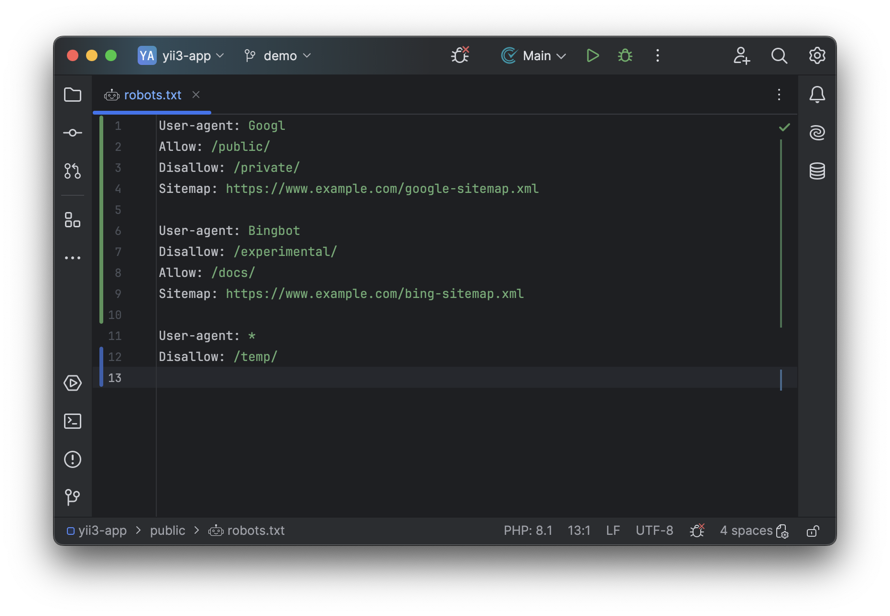

# Robots.txt

<!-- Plugin description -->

[GitHub](https://github.com/j-plugins/robots-txt-plugin) | [Telegram](https://t.me/jb_plugins/6) | [Donation](https://github.com/xepozz/xepozz?tab=readme-ov-file#become-a-sponsor)

## Robots.txt Support

[Robots.txt](https://en.wikipedia.org/wiki/Robots.txt) syntax support.

Advantages:

- Syntax highlight
- Directives completion (soon)
- Wrong paths analyzer (soon)

## Donation

Open-source tools can greatly improve workflows, helping developers and businesses save time and increase revenue.
Many successful projects have been built on these tools, benefiting a wide community.
However, maintaining and enhancing these resources requires continuous effort and investment.

Support from the community helps keep these projects alive and ensures they remain useful for everyone.
Donations play a key role in sustaining and improving these open-source initiatives.

Chose the best option for you to say thank you:

[ Patreon](https://patreon.com/xepozz)
|
[ Buy me a coffee](https://buymeacoffee.com/xepozz)
|
[ Boosty](https://boosty.to/xepozz)

<!-- Plugin description end -->

## Screenshots

#### Basic usage

